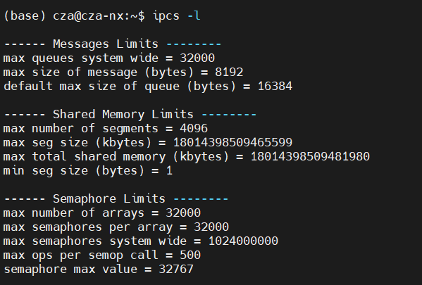
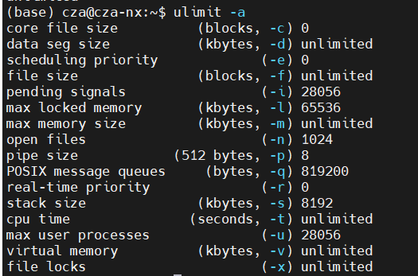
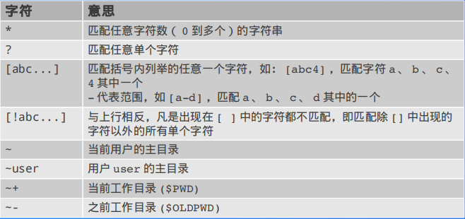
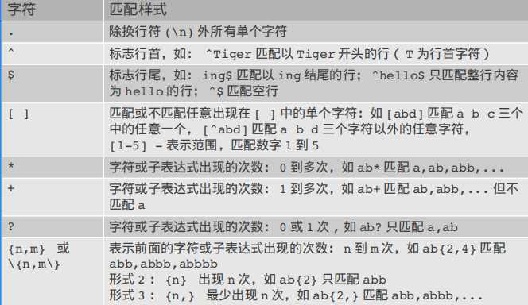
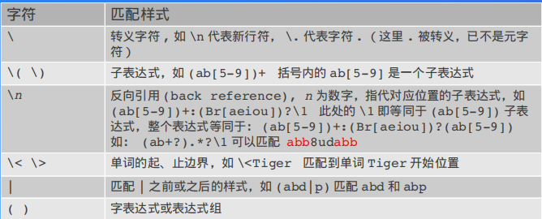
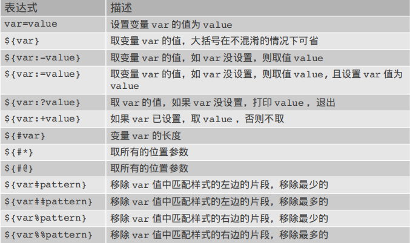
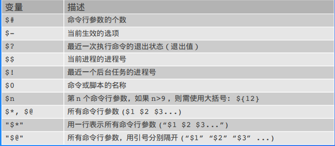

[TOC]

一般 Linux 命令的格式

 command [­options] [arguments]

 一些通用的选项

● ­f ：强制执行

● ­h ： human readable （如将文件尺寸单位表示为 K 或 M ，便于阅读）

● ­i ：开启交互模式

● ­R （或 ­r ）：递归的执行（操作目录相关的命令）

相关链接： [Linux命令大全](https://www.linuxcool.com/)

在线手册 manpage info 

## 文件管理命令


### 查看文件夹 ls

```html
## ls [-aAdfFhilnrRSt] file|dir
-a ：列出全部的文件
-d ：仅列出目录本身
-l ：以长数据串行列出，包含文件的属性与权限等等数据
```
### 创建、删除文件夹 mkdir

```text
## mkdir [-mp] 目录名称
-m ：配置目录权限
-p ：递归创建目录
```

```html
rmdir [-p] 目录名称
-p ：递归删除目录
```
### 复制文件夹 cp

```html
cp [-adfilprsu] source destination
-a ：相当于 -dr --preserve=all
-d ：若来源文件为链接文件，则复制链接文件属性而非文件本身
-i ：若目标文件已经存在时，在覆盖前会先询问
-p ：连同文件的属性一起复制过去
-r ：递归复制
-u ：destination 比 source 旧才更新 destination，或 destination 不存在的情况下才复制
--preserve=all ：除了 -p 的权限相关参数外，还加入 SELinux 的属性, links, xattr 等也复制了
```
### 修改文件权限 chmod

可以将一组权限用数字来表示，此时一组权限的 3 个位当做二进制数字的位，从左到右每个位的权值为 4、2、1，即每个权限对应的数字权值为 r : 4、w : 2、x : 1。

```html
## chmod [-R] xyz dirname/filename
```
```html
## chmod [ugoa]  [+-=] [rwx] dirname/filename
- u：拥有者
- g：所属群组
- o：其他人
- a：所有人
- +：添加权限
- -：移除权限
- =：设定权限
```
### 查看文件 cat more less head tail

cat 直接查看从头往后全部

tac 从后往前全部

more 分页 可以用于管道

less  允许向前翻页

head 文件前面几行

tail 文件最后几行

od 以字符或者十六进制的形式显示二进制文件

### 文件搜索 whereis locate find

whereis 

```html
whereis [-bmsu] dirname/filename
```

locate 可以使用关键字或者正则表达式进行搜索

```html
## locate [-ir] keyword
-r：正则表达式
```

find 可以使用文件的属性和权限进行搜索(更加精确)

```html
## find [basedir] [option]
example: find . -name "shadow*"
```

### 文件打包与压缩 tar zip gzip bzip

```html
$ tar [-z|-j|-J] [cv] [-f 新建的 tar 文件] filename...  ==打包压缩
$ tar [-z|-j|-J] [tv] [-f 已有的 tar 文件]              ==查看
$ tar [-z|-j|-J] [xv] [-f 已有的 tar 文件] [-C 目录]    ==解压缩
-z ：使用 zip；
-j ：使用 bzip2；
-J ：使用 xz；
-c ：新建打包文件；
-t ：查看打包文件里面有哪些文件；
-x ：解打包或解压缩的功能；
-v ：在压缩/解压缩的过程中，显示正在处理的文件名；
-f : filename：要处理的文件；
-C 目录 ： 在特定目录解压缩。
```

tar -zcv  .zip文件 文件夹

tar -ztv  zip文件 文件夹

tar -zxv  zip文件 文件夹

以及下面的用于特定方式的

gzip 创建 gzip 格式的压缩文件

gunzip 解压 gzip 格式的压缩文件

bzip2 创建 bzip2 格式的压缩文件

bunzip2 解压 bzip2 格式的压缩文件

zip 创建 zip 格式的压缩文件

unzip 解压 zip 格式的压缩文件

zcat 查看 gzip 压缩包内文件的内容

zmore 查看 gzip 压缩包内文件的内容

bzcat 查看 bzip2 压缩包内文件的内容

bzmore 查看 bzip2 压缩包内文件的内容

ar 创建、修改、解包归档文件（类似于 tar ）

## 系统管理命令

### 系统进程状态ps

UNIX 风格：

● ­e 、 ­A ：显示所有进程 

● ­f ：显示完整的列表模式

● ­w ：宽格式显示（如显示完整的程序路径和名称，不论行长度） 

● BSD 风格（不带 ­ ）：

● a ：显示所有进程 

● u ：以用户为主的格式来显示进程状况

● x ：显示所有程序，不论是否为终端进程（如 X 进程）

● w ：宽格式显示（如显示完整的程序路径和名称）

一般使用 ps aux 配合管道

### 系统用户状态who/w

w相比于who显示的内容更多

### 系统监控工具 htop/top/atop  ftptop apachetop iotop powertop mytop glances Sar

top是linux系统中常见的工具，类似于任务管理器，一般linux系统都存在

其他的工具都是需要自己安装的，类似于windows下面各种电脑管家.

网络服务器整体性能apachetop

ftp服务器基本信息 ftptop

IO监控 iotop

电量消耗和电源管理 powertop

监控mysql的纯种和性能mytop

系统运行参数分析 htop/top/atop

系统监控工具 glances

个人认为htop是里面比较清楚和好用的一款，这些工具一般用于查看系统状态

### 状态统计工具  netstat free vnstat mpstat

和top一样，很多不常用，常用的就只有netstat和free

**控制台的流量监控工具vnstat(需要安装，没啥用)**

**监控多处理器使用情况 mpstat(需要安装，没啥用)**

**CPU平均负载和磁盘活动iostat**

**内存使用状态 free **

**查看网络状态netstat**

此命令由于显示网络连接，路由表，接口状态，伪装连接，网络链路纤细和组播成员组等

选项：

`­a ：所有侦听或不在侦听的 socket 状态`

`c ：每秒刷新一次统计输出结果` 

`e ：附加信息，使用 2 次获取更详细的信息`

`­n ：数字形式的主机名` 

` ­p ：显示 socket 所属的进程 ID 和进程名`

`­t ：只查看 tcp 协议的 socket`

`­u ：只查看 udp 协议的 socket`

`delay ：一个整数，按指定的时间间隔刷新统计输出结果`

### 进程间通设施状态ipcs

多进程间通信常用的方式, 共享内存、消息队列、信号量

**常用参数：**

| -a   | 默认的输出信息                         |
| ---- | -------------------------------------- |
| -m   | 打印出使用共享内存进行进程间通信的信息 |
| -q   | 打印出使用消息队列进行进程间通信的信息 |
| -s   | 打印出使用信号进行进程间通信的信息     |
| -t   | 输出信息的详细变化时间                 |
| -p   | 输出ipc方式的进程                      |
| -u   | 输出当前系统下ipc各种方式的状态信息    |
| -l   | 查看各个资源的系统限制信息             |



### 系统限制查看 ulimit

查看和设置用户使用系统资源的限制 例如用户最大线程数，虚拟内存限制 最大锁页内存

常用参数：

| -a   | 显示目前资源限制的设定            |
| ---- | --------------------------------- |
| -d   | 程序数据节区的最大值，单位为KB    |
| -t   | 指定CPU使用时间的上限，单位为秒   |
| -u   | 用户最多可开启的程序数目          |
| -v   | 指定可使用的虚拟内存上限,单位为KB |



使用`getconf PAGESIZE` 获取内存页大小

### 跟踪系统调用strace

需要安装

strace常用来跟踪进程执行时的系统调用和所接收的信号。 在Linux世界，进程不能直接访问硬件设备，当进程需要访问硬件设备(比如读取磁盘文件，接收网络数据等等)时，必须由用户态模式切换至内核态模式，通 过系统调用访问硬件设备。strace可以跟踪到一个进程产生的系统调用,包括参数，返回值，执行消耗的时间。

**常用参数：**

| -c   | 统计每一系统调用的所执行的时间,次数和出错的次数等 |
| ---- | ------------------------------------------------- |
| -d   | 输出strace关于标准错误的调试信息                  |
| -f   | 跟踪由fork调用所产生的子进程                      |
| -F   | 尝试跟踪vfork调用.在-f时,vfork不被跟踪            |
| -a   | 设置返回值的输出位置.默认 为40                    |
| -r   | 打印出相对时间关于每一个系统调用                  |
| -t   | 在输出中的每一行前加上时间信息                    |
| -e   | 跟踪所有的系统调用                                |

通用的完整用法，跟踪28979进程的所有系统调用（-e trace=all），并统计系统调用的花费时间，以及开始时间（并以可视化的时分秒格式显示），最后将记录结果存在output.txt文件里面：

```
strace -o output.txt -T -tt -e trace=all -p 28979
```

## 网络通信命令


### 远程登录协议 telnet

应用层  明文传输 采用默认端口23 不安全

连接主机后进入命令模式，主要用于检测服务进程是否运行  不怎么使用

### 安全shell协议 ssh

ssh位于会话层，相比于telnet明文传输更加安全，使用默认端口号22 存在两种安全验证

**第一种级别（基于口令的安全验证）**

ssh -p 5130 yjt@202.114.107.175

输入密码

**第二种级别（基于秘钥的安全验证）**

ssh -p 5130 -i C:/Users/Admin/.ssh/yjt.yjt yjt@202.114.107.175

输入passphrase(服务器公私钥创建时候的密码)

不需要密码进行登录：将自己本地生成(使用ssh-keygen)的公钥 追加到服务器上authorized_keys中

ssh -p 5130 -i C:/Users/Admin/.ssh/id_rsa @202.114.107.175

此时不需要输入passphrase

**scp 安全远程复制文件**

第一种级别和第二种依旧是一个秘钥的区别 增加-i操作

在5150传输文件到5130

`scp -P 5130 /data2/jxy/ yjt@202.114.107.175:/data1/yjt/ -i key to 5130  ` 

在5150复制5130的文件：

`scp -P 5130 yjt@202.114.107.175:/data1/yjt/ /data2/jxy/ -i key to 5130  ` 

如果存在passphase 则还需要输入passphrase

如果需要不输入passphase可以向上面一样复制公钥

因此，为保证安全性，在创建公钥秘钥之后最好更改文件权限、设置passphrase

**fstp：ssh基础上的ftp**

主要用于文件传输，scp用于拷贝，这个相比于scp功能更多一些，存在 ls cd mkdir  get push等（不止复制）

登录：sftp +后面和ssh一样

### 配置网络接口 ifconfig

`ifconfig -a` 查看所有可用网络接口的信息

up down 启用禁用网络接口 需要root

### 查看网络状态netstat

此命令由于显示网络连接，路由表，接口状态，伪装连接，网络链路纤细和组播成员组等

选项：

`­a ：所有侦听或不在侦听的 socket 状态`

`c ：每秒刷新一次统计输出结果` 

`e ：附加信息，使用 2 次获取更详细的信息`

`­n ：数字形式的主机名` 

` ­p ：显示 socket 所属的进程 ID 和进程名`

`­t ：只查看 tcp 协议的 socket`

`­u ：只查看 udp 协议的 socket`

`delay ：一个整数，按指定的时间间隔刷新统计输出结果`

### 域名查询工具 jwhois

首先安装 whois

自己查询失败，使用其他厂家提供的whois服务进行域名查询，例如

[域名信息查询 - 腾讯云 (tencent.com)](https://whois.cloud.tencent.com/)

### 网络数据包案分析 tcpdump

linux下最常用的抓包工具，首先需要安装

其次就不写了，抓包还是用可视化的fidder 或者 wireshark比较方便

### 获取实时网络统计信息 iptraf

iptraf-ng命令是一个基于ncurses的IP LAN监视器，可生成各种网络统计信息，包括TCP信息，UDP计数，ICMP和OSPF信息，以太网负载信息，节点统计信息，IP校验和错误等等。

## 磁盘参数工具

### 文件系统df

disk free 显示磁盘还剩余多少容量

df -h

### 磁盘挂载 mount 卸载umount

文件挂载命令，现在很少用了

### PCI总线信息

lspci

## 其他常用重要命令和工具

### 正则表达式工具 grep awk

文件名通配符：



shell命令中文件通配和正则表达式样式的区别

**正则表达式的样式需要使用双引号或者单引号**

例如 `grep '[A-Z]*' c[a-c].sql` 在文件中寻找含有大匹配行数写字母的行

基本正则表达式的元字符：





linux命令中 grep可以和|（管道命令）一起使用

grep命令：打印文件中匹配个样式的行

执行方式：grep [options] pattern [files]

-E 扩展的grep egrep

-f regex-file:从文件中获取正则表达式

-i 不区分大小写

控制输出选项：

-c: 只输出文件中匹配的行数

-l: 只输出内容匹配的文件名

-L 输出内容没有匹配的文件名

-m num: 找到num个就停止

可以使用管道命令套用。

### 计划定时任务  at crontab

**at适合执行一次就结束的调度任务**

anacrontab适合于非7*24小时开机的服务器准备的，是以天为单位执行的，不能指定以分钟的定时任务，在停机期间没有任务执行，可以开机时执行。

**cron服务是Linux的内置服务**，但它不会开机自动启动，可以每分钟执行任务。可以用以下命令启动和停止服务：

以下来自菜鸟：

**注意：**新创建的 cron 任务，不会马上执行，至少要过 2 分钟后才可以，当然你可以重启 cron 来马上执行。

而 linux 任务调度的工作主要分为以下两类：

- 1、系统执行的工作：系统周期性所要执行的工作，如备份系统数据、清理缓存

- 2、个人执行的工作：某个用户定期要做的工作，例如每隔 10 分钟检查邮件服务器是否有新信，这些工作可由每个用户自行设置

方式一：从文件读取任务

```
crontab [ -u user ] file
```
方式二：从键盘输入任务

```
crontab [ -u user ] { -l | -r | -e }
```

其中-l 列出指定用户的计划任务 -e 从键盘输入任务 -r删除任务

cronfile的前面的格式如下：

```
f1 f2 f3 f4 f5 program
```

- 其中 f1 是表示分钟，f2 表示小时，f3 表示一个月份中的第几日，f4 表示月份，f5 表示一个星期中的第几天。program 表示要执行的程序。
- 当 f1 为 * 时表示每分钟都要执行 program，f2 为 * 时表示每小时都要执行程序，其馀类推
- 当 f1 为 a-b 时表示从第 a 分钟到第 b 分钟这段时间内要执行，f2 为 a-b 时表示从第 a 到第 b 小时都要执行，其馀类推
- 当 f1 为 */n 时表示每 n 分钟个时间间隔执行一次，f2 为 */n 表示每 n 小时个时间间隔执行一次，其馀类推
- 当 f1 为 a, b, c,... 时表示第 a, b, c,... 分钟要执行，f2 为 a, b, c,... 时表示第 a, b, c...个小时要执行，其馀类推

```
*    *    *    *    *
-    -    -    -    -
|    |    |    |    |
|    |    |    |    +----- 星期中星期几 (0 - 6) (星期天 为0)
|    |    |    +---------- 月份 (1 - 12) 
|    |    +--------------- 一个月中的第几天 (1 - 31)
|    +-------------------- 小时 (0 - 23)
+------------------------- 分钟 (0 - 59)
```

使用者也可以将所有的设定先存放在文件中，用 crontab file 的方式来设定执行时间。

**实例**

每一分钟执行一次 /bin/ls：

```
* * * * * /bin/ls
```

在 12 月内, 每天的早上 6 点到 12 点，每隔 3 个小时 0 分钟执行一次 /usr/bin/backup：

```
0 6-12/3 * 12 * /usr/bin/backup
```

周一到周五每天下午 5:00 寄一封信给 alex@domain.name：

```
0 17 * * 1-5 mail -s "hi" alex@domain.name < /tmp/maildata
```

每月每天的午夜 0 点 20 分, 2 点 20 分, 4 点 20 分....执行 echo "haha"：

```
20 0-23/2 * * * echo "haha"
```

下面再看看几个具体的例子：

```
0 */2 * * * /sbin/service httpd restart  意思是每两个小时重启一次apache 

50 7 * * * /sbin/service sshd start  意思是每天7：50开启ssh服务 

50 22 * * * /sbin/service sshd stop  意思是每天22：50关闭ssh服务 

0 0 1,15 * * fsck /home  每月1号和15号检查/home 磁盘 

1 * * * * /home/bruce/backup  每小时的第一分执行 /home/bruce/backup这个文件 

00 03 * * 1-5 find /home "*.xxx" -mtime +4 -exec rm {} \;  每周一至周五3点钟，在目录/home中，查找文件名为*.xxx的文件，并删除4天前的文件。

30 6 */10 * * ls  意思是每月的1、11、21、31日是的6：30执行一次ls命令
```

**注意：**当程序在你所指定的时间执行后，系统会发一封邮件给当前的用户，显示该程序执行的内容，若是你不希望收到这样的邮件，请在每一行空一格之后加上 **> /dev/null 2>&1** 即可，如：

```
20 03 * * * . /etc/profile;/bin/sh /var/www/runoob/test.sh > /dev/null 2>&1 
```

### 不挂断执行任务nohup screen

为了防止由于网络连接带来的任务中断，离线任务

安装 之后screen --help 查看选项

最常用的方式：

新建虚拟终端`screen -S name` 

创建完之后在该终端执行命名

挂起这个任务  键盘： ctrl+A +d 

`screen -ls` 查看现有终端和状态

恢复虚拟中端

`screen -r pid`

清除多余终端：进入之后 exit退出虚拟终端

链接：[Linux终端命令神器--Screen命令详解。助力Linux使用和管理 - 云+社区 - 腾讯云 (tencent.com)](https://cloud.tencent.com/developer/article/1844735)

### Bash Shell脚本

所有的linux命令都可以在shell脚本中直接执行，主要关于变量部分在此处列出：

变量替代：



内置变量



如何输入外部参数？也就是上图中所用的命令行参数

假设存在脚本:

```
[root@Centos7T blogscripts]#cat t1.sh
#!/bin/bash
echo "Script name is : $0"
echo "The 1st parameter is : $1"
echo "The 2nd parameter is : $2"
echo "The 3rd parameter is : $3"
```

使用`bash t1.sh 100 200 300` 运行

但是由于脚本中使用了$1等参数，如果没输入会报错，最好进行一下判断，并抛出由于命令行参数缺失或者不规范产生的异常信息，方便调试。

### Git版本管理工具


### RPM包管理工具


### gdb调试工具


### Cmake编译工具
