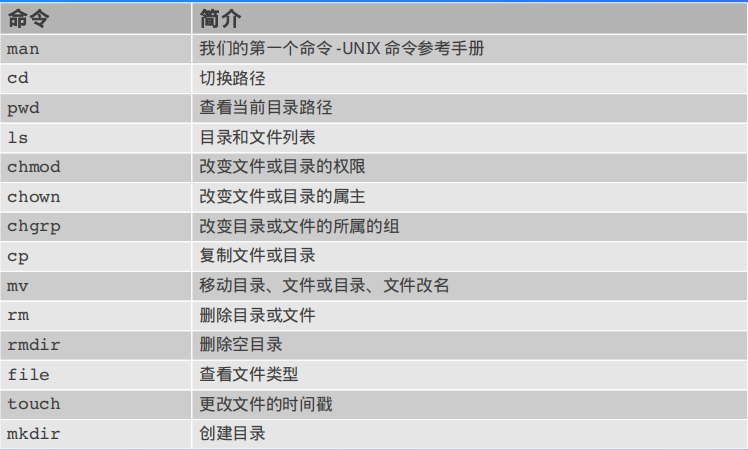
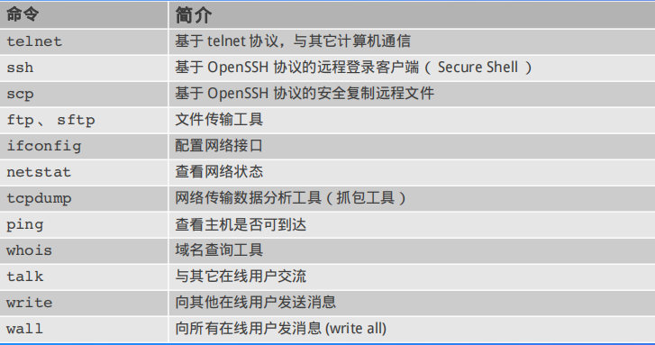

[TOC]

记录常用的一些命令工具和参数，不仅仅是为了面试，也方便自己后面查询，使用。

一般 Linux 命令的格式

 command [­options] [arguments]

 一些通用的选项

● ­f ：强制执行

● ­h ： human readable （如将文件尺寸单位表示为 K 或 M ，便于阅读）

● ­i ：开启交互模式

● ­R （或 ­r ）：递归的执行（操作目录相关的命令）

## 文件管理命令




### 查看文件夹 ls

```html
## ls [-aAdfFhilnrRSt] file|dir
-a ：列出全部的文件
-d ：仅列出目录本身
-l ：以长数据串行列出，包含文件的属性与权限等等数据
```
### 创建、删除文件夹 mkdir

```text
## mkdir [-mp] 目录名称
-m ：配置目录权限
-p ：递归创建目录
```

```html
rmdir [-p] 目录名称
-p ：递归删除目录
```
### 复制文件夹 cp

```html
cp [-adfilprsu] source destination
-a ：相当于 -dr --preserve=all
-d ：若来源文件为链接文件，则复制链接文件属性而非文件本身
-i ：若目标文件已经存在时，在覆盖前会先询问
-p ：连同文件的属性一起复制过去
-r ：递归复制
-u ：destination 比 source 旧才更新 destination，或 destination 不存在的情况下才复制
--preserve=all ：除了 -p 的权限相关参数外，还加入 SELinux 的属性, links, xattr 等也复制了
```
### 修改文件权限 chmod

可以将一组权限用数字来表示，此时一组权限的 3 个位当做二进制数字的位，从左到右每个位的权值为 4、2、1，即每个权限对应的数字权值为 r : 4、w : 2、x : 1。

```html
## chmod [-R] xyz dirname/filename
```
```html
## chmod [ugoa]  [+-=] [rwx] dirname/filename
- u：拥有者
- g：所属群组
- o：其他人
- a：所有人
- +：添加权限
- -：移除权限
- =：设定权限
```
### 查看文件 cat more less head tail

cat 直接查看从头往后全部

tac 从后往前全部

more 分页 可以用于管道

less  允许向前翻页

head 文件前面几行

tail 文件最后几行

od 以字符或者十六进制的形式显示二进制文件

### 文件搜索 whereis locate find

whereis 

```html
whereis [-bmsu] dirname/filename
```

locate 可以使用关键字或者正则表达式进行搜索

```html
## locate [-ir] keyword
-r：正则表达式
```

find 可以使用文件的属性和权限进行搜索(更加精确)

```html
## find [basedir] [option]
example: find . -name "shadow*"
```

### 文件打包与压缩 tar zip gzip bzip

```html
$ tar [-z|-j|-J] [cv] [-f 新建的 tar 文件] filename...  ==打包压缩
$ tar [-z|-j|-J] [tv] [-f 已有的 tar 文件]              ==查看
$ tar [-z|-j|-J] [xv] [-f 已有的 tar 文件] [-C 目录]    ==解压缩
-z ：使用 zip；
-j ：使用 bzip2；
-J ：使用 xz；
-c ：新建打包文件；
-t ：查看打包文件里面有哪些文件；
-x ：解打包或解压缩的功能；
-v ：在压缩/解压缩的过程中，显示正在处理的文件名；
-f : filename：要处理的文件；
-C 目录 ： 在特定目录解压缩。
```

tar -zcv  .zip文件 文件夹

tar -ztv  zip文件 文件夹

tar -zxv  zip文件 文件夹

以及下面的用于特定方式的

gzip 创建 gzip 格式的压缩文件

gunzip 解压 gzip 格式的压缩文件

bzip2 创建 bzip2 格式的压缩文件

bunzip2 解压 bzip2 格式的压缩文件

zip 创建 zip 格式的压缩文件

unzip 解压 zip 格式的压缩文件

zcat 查看 gzip 压缩包内文件的内容

zmore 查看 gzip 压缩包内文件的内容

bzcat 查看 bzip2 压缩包内文件的内容

bzmore 查看 bzip2 压缩包内文件的内容

ar 创建、修改、解包归档文件（类似于 tar ）

## 系统管理命令

### 系统进程状态ps

UNIX 风格：

● ­e 、 ­A ：显示所有进程 

● ­f ：显示完整的列表模式

● ­w ：宽格式显示（如显示完整的程序路径和名称，不论行长度） 

● BSD 风格（不带 ­ ）：

● a ：显示所有进程 

● u ：以用户为主的格式来显示进程状况

● x ：显示所有程序，不论是否为终端进程（如 X 进程）

● w ：宽格式显示（如显示完整的程序路径和名称）

一般使用 ps aux

### 虚拟内存统计工具 smstat


### 控制台的流量监控工具vnstat

### 内存使用状态 free

查看内存使用状态

### 进程间通设施状态ipcs

### linux系统运行时长

### CPU平均负载和磁盘活动iostat

### 监控、收集、和汇报系统活动 Sar

### 监控多处理器使用情况 mpstat

### 系统管理源调优和基准测量工具 nmon

### 密切关注linxu系统glances

### 查看系统调用strace

## 网络通信命令

<!--  -->

### 远程登录协议 telnet

应用层  明文传输 采用默认端口23 不安全

连接主机后进入命令模式，主要用于检测服务进程是否运行  不怎么使用

### 安全shell协议 ssh

ssh位于会话层，相比于telnet明文传输更加安全，使用默认端口号22 存在两种安全验证

**第一种级别（基于口令的安全验证）**

ssh -p 5130 yjt@202.114.107.175

输入密码

**第二种级别（基于秘钥的安全验证）**

ssh -p 5130 -i C:/Users/Admin/.ssh/yjt.yjt yjt@202.114.107.175

输入passphrase(服务器公私钥创建时候的密码)

不需要密码进行登录：将自己本地生成(使用ssh-keygen)的公钥 追加到服务器上authorized_keys中

ssh -p 5130 -i C:/Users/Admin/.ssh/id_rsa @202.114.107.175

此时不需要输入passphrase

**scp 安全远程复制文件**

第一种级别和第二种依旧是一个秘钥的区别 增加-i操作

在5150传输文件到5130

`scp -P 5130 /data2/jxy/ yjt@202.114.107.175:/data1/yjt/ -i key to 5130  ` 

在5150复制5130的文件：

`scp -P 5130 yjt@202.114.107.175:/data1/yjt/ /data2/jxy/ -i key to 5130  ` 

如果存在passphase 则还需要输入passphrase

如果需要不输入passphase可以向上面一样复制公钥

因此，为保证安全性，在创建公钥秘钥之后最好更改文件权限、设置passphrase

**fstp：ssh基础上的ftp**

主要用于文件传输，scp用于拷贝，这个相比于scp功能更多一些，存在 ls cd mkdir  get push等（不止复制）

登录：sftp +后面和ssh一样

### **配置网络接口 ifconfig**

`ifconfig -a` 查看所有可用网络接口的信息

up down 启用禁用网络接口 需要root

### 查看网络状态netstat

此命令由于显示网络连接，路由表，接口状态，伪装连接，网络链路纤细和组播成员组等

选项：

`­a ：所有侦听或不在侦听的 socket 状态`

`c ：每秒刷新一次统计输出结果` 

`e ：附加信息，使用 2 次获取更详细的信息`

`­n ：数字形式的主机名` 

` ­p ：显示 socket 所属的进程 ID 和进程名`

`­t ：只查看 tcp 协议的 socket`

`­u ：只查看 udp 协议的 socket`

`delay ：一个整数，按指定的时间间隔刷新统计输出结果`

### 域名查询工具 whois

一般不用

### 显示和修改网络接口控件器 ethtool

### 网络数据包案分析 tcpdump

### 获取实时网络统计信息 iptraf

### 显示主机上网络接口带宽使用情况 iftop


## 磁盘参数工具

### 磁盘卸载umount

### 读取、转换并输出数据dd

### 文件系统df

### 磁盘挂载 mount

## 日志监控工具

### 实时网络日志分析器 CoAccess

### 多窗口日志监控MUltiTail

### 日志分析系统LogWatch/SWatch

## 参数监控工具

### 监控apache 网络服务器整体性能apachetop

### ftp服务器基本信息 ftptop

### IO监控 iotop

### 电量消耗和电源管理 powertop

### 监控mysql的纯种和性能mytop

### 系统运行参数分析 htop/top/atop

