[TOC]

参考自康师傅： [MySQL数据库教程天花板，mysql安装到mysql高级，强！硬！_哔哩哔哩_bilibili](https://www.bilibili.com/video/BV1iq4y1u7vj?spm_id_from=333.337.search-card.all.click)

## MySQL初级技术

SQL基本语句

登录 `mysql -u root -p` 

导入数据 `source d:\mysqldb.sql`

`show databases|tables|`  显示数据库或者表

`desc describe` 显示表结构

### SQL SELECT使用

#### **基本语句**

`SELECT 1;` #没有任何子句 

`SELECT 9/2;` #没有任何子句 

选择特定的列 `select from`

选择并别名一个列， as 可以省略，别名可以双引号   `select last_name as name from employees;`

去除重复行 distinct ,需要放到所有列名的前面，组合去重  `select distinc department_id, salary from employees`

如果表中命名和保留字冲突 使用``修饰进行转义

`select from where 过滤内容`

select 语句中支持各种运算符和函数：

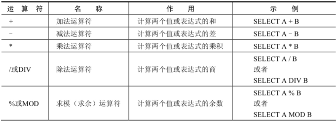


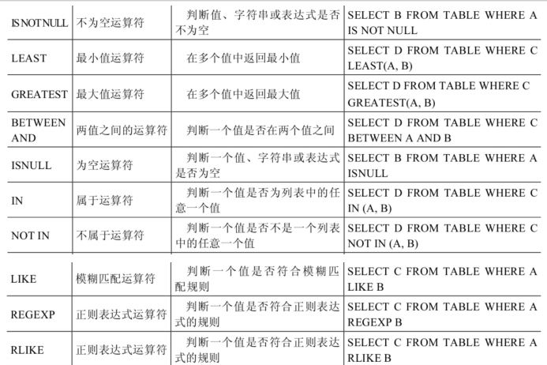

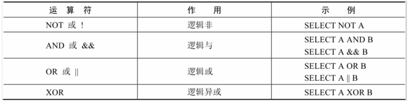

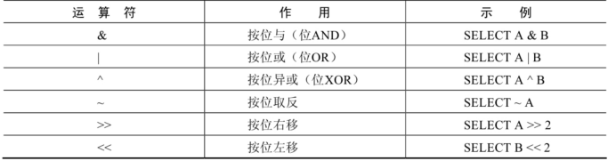

其中各种运算符符号与C语言并无区别，额外注意：

`<=> 和 =` 区别在于安全等于运算符可以处理null值，null=null 输出 0 null<=>null 输出1

`<> 和 !=` 不等于运算符不能判断NULL值。如果两边的值有任意一个为NULL，则结果为NULL。

`like运算符` 使用模糊匹配，使用的是通配符，但是和LInux讲中通配符表达不一致

% 匹配0个或者多个字符 相当于文件通配符* _ 匹配一个字符 相当于文件通配符？以及正则表达的.

此外 使用like运算符之后 就需要使用`‘ ’`将修饰通配符表达式，转义字符等，例如：

`SELECT job_id  FROM jobs WHERE job_id LIKE ‘IT$_%’ escape '$';`

`regexp 运算符`  正则表达式，其用法和linux正则表达式一样，例如

`SELECT * FROM fruits WHERE f_name REGEXP '^ba+';`

#### 排序分页、多表查询

**使用order by 子句排序 默认 asc升序 desc降序**

单列排序案例：

```
SELECT last_name, job_id, department_id, hire_date 
FROM employees 
ORDER BY hire_date DESC ;
```

多列排序案例：

```
SELECT last_name, department_id, salary
FROM employees 
ORDER BY department_id, salary DESC;
```

可以使用不在select列表中的列排序，首先对第一列排序，然后对第二列排序

使用`limit` 进行分页 ，必须放置在where子句的最后，提升查询效率

`LIMIT [位置偏移量,] 行数`  注意linux中head tail等命令分页使用 -n 例如 head a.txt -n 5

**多表查询：from多个表**

from中可以使用别名，如果使用则 on 以及where中都需要使用

笛卡尔积出现条件：省略多个表的连接条件（或关联条件）连接条件（或关联条件）无效   所有表中的所有行互相连接

避免方式：通过where子句增加连接条件,表中有相同列时候，增加表明前缀区分

```
#案例：查询员工的姓名及其部门名称 
SELECT last_name, department_name 
FROM employees, departments 
WHERE employees.department_id = departments.department_id;
```

此外，通常使用join on语句进行连接，比上述方式更加清楚，最长使用left方式

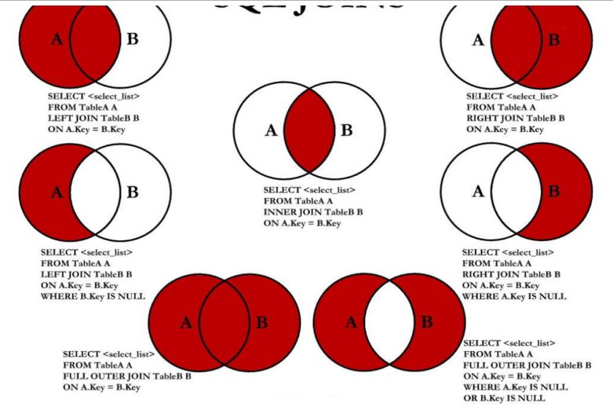 

一般来说，多表连接相当于使用嵌套for循环，应该避免使用多次，控制表的数量

#### 单行、聚合函数、子查询

**单行函数** 列举部分，不用背

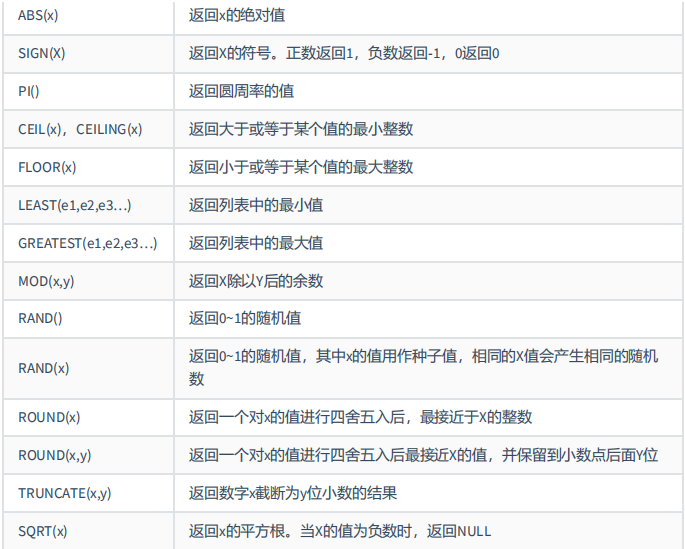

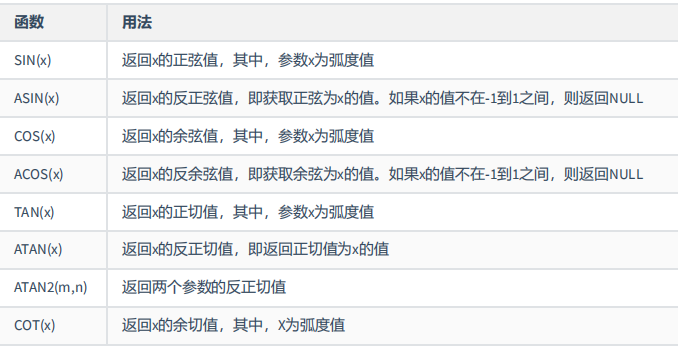

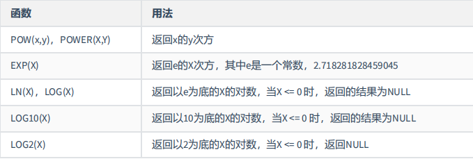

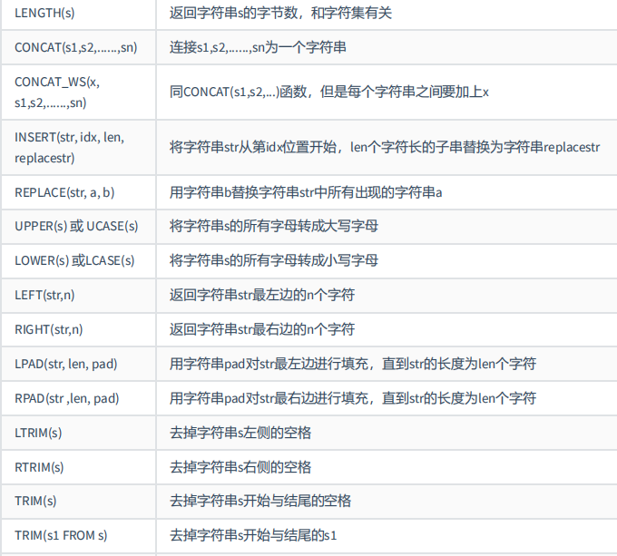

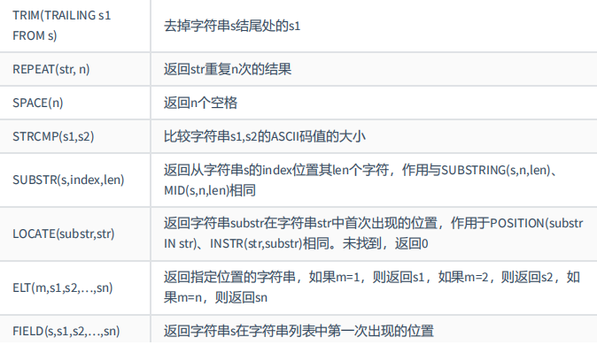

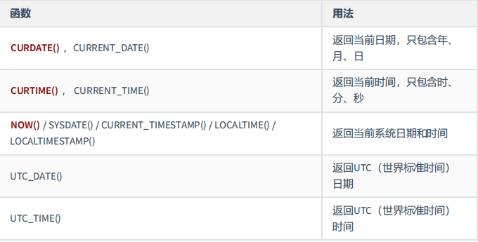

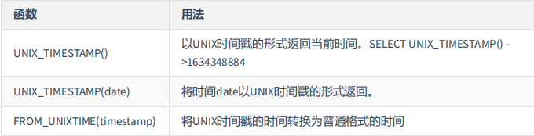

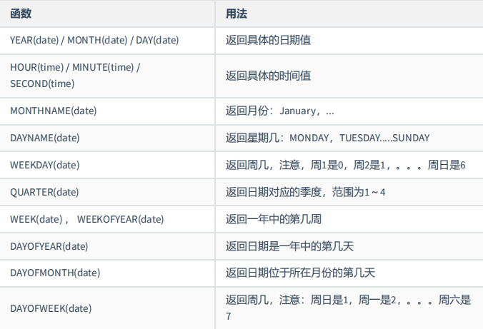

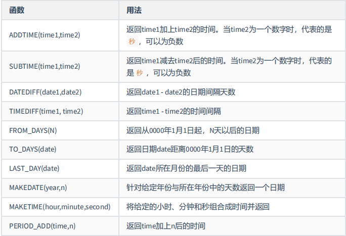

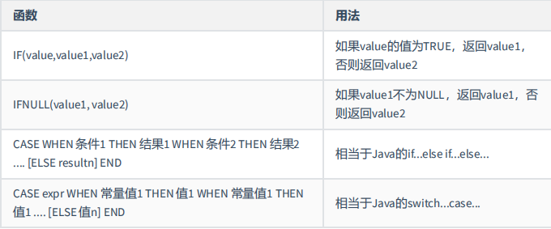

**聚合函数** 比较重要

`AVG SUM MAX MIN COUNT` 案例：

```
SELECT AVG(salary), MAX(salary),MIN(salary), SUM(salary) 
FROM employees 
WHERE job_id LIKE '%REP%';
```

`GROUP BY 列分组、统计分析函数、可以使用多个列分组 和order by 类似`

```
SELECT column, group_function(column) 
FROM table 
[WHERE condition] 
[GROUP BY group_by_expression] 
[ORDER BY column];
```

`having 子句 只能用于 使用了聚合函数的 分组过滤 `

where不能用于聚合函数，出错案例：

```
SELECT department_id, AVG(salary) 
FROM employees 
WHERE AVG(salary) > 8000 
GROUP BY department_id;
```

WHERE  先筛选数据再关联，执行效率高  不能使用分组中的计算函数进行筛选

HAVING 可以使用分组中的计算函数  在最后的结果集中进行筛选，执行效率较低

总结模板

```
#方式2： 
SELECT ...,....,... 
FROM ... 
JOIN ... 
ON 多表的连接条件 
JOIN ... 
ON ... 
WHERE 不包含组函数的过滤条件 
AND/OR 不包含组函数的过滤条件 
GROUP BY ...,... 
HAVING 包含组函数的过滤条件 
ORDER BY ... ASC/DESC 
LIMIT ...,...
```

**子查询** select嵌套

谁的工资比Abel的高？

```
#方式1：自连接 
SELECT e2.last_name,e2.salary 
FROM employees e1,employees e2 
WHERE e1.last_name = 'Abel' 
AND e1.`salary` < e2.`salary`
```

```
#方式2：子查询 
SELECT last_name,salary FROM employees 
WHERE salary > ( 
SELECT salary 
FROM employees 
WHERE last_name = 'Abel' );
```

使用自连接更好，因为一般数据库系统对自连接做了优化，子查询类似于多了一步中间变量或者条件判断

相关子查询 和 不相关子查询

多行比较操作符

IN ANY ALL 案例：查询平均工资最低的部门id

```
SELECT department_id 
FROM employees 
GROUP BY department_id 
HAVING AVG(salary) <= ALL ( 
    SELECT AVG(salary) avg_sal 
    FROM employees 
    GROUP BY department_id )
```

**相关子查询**，子查询中用到了外部主查询的表，案例：

查询员工中工资大于**本部门平均工资**的员工的last_name,salary和其department_id

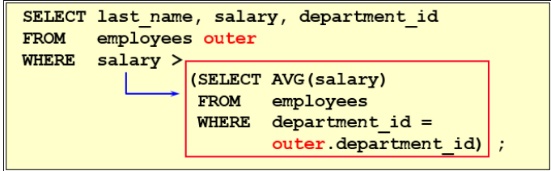

计算平均工资，但是是本部门, 另外一种方式是在from中应用子查询 然后自连接，比较难以理解

```
SELECT last_name,salary,e1.department_id 
FROM employees e1,(SELECT department_id,AVG(salary) dept_avg_sal 
    FROM employees 
    GROUP BY department_id) e2 
WHERE e1.`department_id` = e2.department_id AND e2.dept_avg_sal < e1.`salary`;
```

order by 中使用子查询案例 查询员工的id,salary,按照department_name 排序(多表时候需要，否则不需要)

```
SELECT employee_id,salary 
FROM employees e 
ORDER BY ( SELECT department_name 
    FROM departments d 
    WHERE e.`department_id` = d.`department_id` );
```

此外，关联子查询通常也配合exists 和 not exists使用  同一个表尽量用自连接 不同表使用相关

相关更新 相关删除等操作

### DDL/DML/DCL基本使用

DDL（Data Definition Languages、数据定义语言），这些语句定义了不同的数据库、表、视图、索引等数据库对象，还可以用来创建、删除、修改数据库和数据表的结构。

主要的语句关键字包括 CREATE 、 DROP 、 ALTER 等。

DML（Data Manipulation Language、数据操作语言），用于添加、删除、更新和查询数据库记

录，并检查数据完整性。主要的语句关键字包括 INSERT 、 DELETE 、 UPDATE 、 SELECT 等。

DCL（Data Control Language、数据控制语言，用于定义数据库、表、字段、用户的访问权限和安全级别。

创建和管理数据库

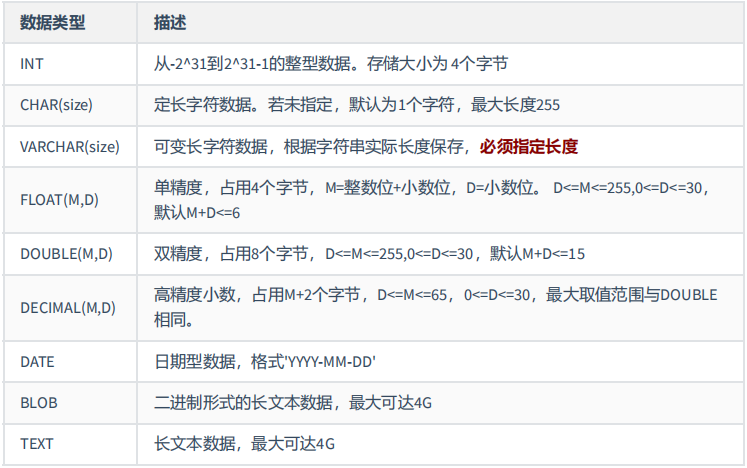

`create database 数据库名字;`

`create database 数据库名 character set 字符集 比如dbk，utf-8`

`create database if not exists 数据库名;`

使用数据库 `use 数据库名`

修改数据库 alter 删除数据库 drop

**创建表**

`create table if not exists 表名（`

`字段1，数据类型 [约束条件] [默认值]`，

`字段2，数据类型 [约束条件] [默认值]`，

`primary key(字段1)`

`）`

可以将select 和创建表联合使用，例如：

```
CREATE TABLE dept80 
AS
SELECT employee_id, last_name, salary*12 ANNSAL, hire_date FROM employees 
WHERE department_id = 80;
```

**修改表** 

追加列

`ALTER TABLE 表名 ADD 【COLUMN】 字段名 字段类型 【FIRST|AFTER 字段名】;`

修改列 数据类型、长度、默认值和位置等

`ALTER TABLE 表名 MODIFY 【COLUMN】 字段名1 字段类型 【DEFAULT 默认值】【FIRST|AFTER 字段名` 

`2】;` 

重命名列

`ALTER TABLE 表名 CHANGE 【column】 列名 新列名 新数据类型;`

删除列

`ALTER TABLE 表名 DROP 【COLUMN】字段名` 

**插入数据**

插入一条数据  `INSERT INTO 表名  VALUES (value1,value2,....)`

同样可以和select联合使用

**更新数据**

`update [] codition`

**删除数据** delete

表**约束**的四个方面：实体完整性 域完整性 引用完整性 用于自定义完整性

包括 各个约束的添加和删除机制

NOT NULL 非空约束，规定某个字段不能为空

UNIQUE 唯一约束，规定某个字段在整个表中是唯一的

PRIMARY KEY 主键(非空且唯一)约束

FOREIGN KEY 外键约束

CHECK 检查约束

DEFAULT 默认值约束

### 其他数据库对象

了解基本对象

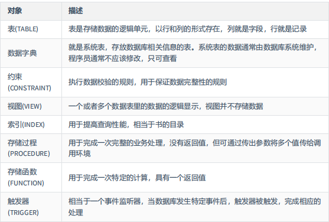

视图：即部分表的可视化

#### 存储过程和函数

里面还包含 变量 循环 条件 游标（结果指针）等概念，不展开。

创建存储过程

```
CREATE PROCEDURE 存储过程名(IN|OUT|INOUT 参数名 参数类型,...)
[characteristics ...]
BEGIN
	存储过程体
END
```

调用存储过程

`CALL 存储过程名(实参列表)` 

创建函数

```
CREATE FUNCTION 函数名(参数名 参数类型,...) RETURNS 返回值类型 
[characteristics ...] 
BEGIN
函数体 
#函数体中肯定有 RETURN 语句
END
```

调用函数

`select 函数名(实参列表)`

但是国内厂家不建议使用这两个封装性功能，因为难以调试，可移植性差 存储过程版本难以管理 不适合高并发

#### 触发器

为了实现关联表的同时操作，就像各种语言中的事件模式

```
CREATE TRIGGER 触发器名称 
{BEFORE|AFTER} {INSERT|UPDATE|DELETE} ON 表名 
FOR EACH ROW 
触发器执行的语句块;
```

优点：保证数据的完整性 记录日志操作 数据合法性检查

缺点：可读性差、相关数据的编程会导致触发器出错

## MySQL高级部分

sql底层原理

索引

当表中的数据量达到几十万甚至上百万的时候，SQL的查询花费时间会很长，导致业务超时，因此需要使用索引来加速SQL查询

由于索引也是需要存储索引文件的，因此对于索引的使用也会涉及I/O操作，如果创建过多的索引，使用不当，会造成SQL查询时候，进行大量的无用的磁盘IO操作，降低查询效率，因此掌握良好的索引创建原则非常重要。


架构

索引和调优

事务

日志和备份


掌握关键技术：

SQL编程(自定义函数、存储过程、触发器、定时任务)

数据库索引建立

SQL语句优化

数据库内部结构和原理

数据库的性能监控分析与系统优化

各种参数常量设定

数据库建模优化

主从复制

分布式架构搭建、垂直切割和水平切割

MyCat

数据迁移

容灾备份和恢复

对开源数据库进行二次开发

## 面试问题

编程技巧：

每个学校答过题的用户平均答题数量情况？

每个：group by 可以按照学校分类（存在每个）

答过题的用户的平均答题数量：  计算每个学校答过题的用户数量 count(distinct(答题id)) 计算每个学校答题数量 count(id),然后除法

两个select联合使用采取 union 联合 （一般存在分别） union会去重 union all不去重

必须会的条件函数 if 和case （存在重命名内容 字段 用于select中）

语法

> Select device_id,if(university = ‘北京大学',’北京大学',’其他大学'）

> as university

> From user_profile

用于对于字段进行更改 增加判断


> Select

> CASE

> WHEN SCORE = 'A' THEN '优'

> WHEN SCORE = 'B' THEN '良'

> WHEN SCORE = 'C' THEN ‘中'

> ELSE ‘不及格'

> END --注意这里需要加end作为结束

后面也可以group by 他们自己

日期函数

将时间戳转换成日期函数

> select

> from_unixtime(time,'yyyy-MM-dd') as time

> From question_practice_detail

将日期函数转换为时间戳

> select

> from_unixtime('2021-08-01','yyyy-MM-dd') as time

年月日获取

分别为year(),month(),day()。

日期差计算

> select

> datediff('2021-08–09','2021-08-01')

data_sub和data_add函数计算开始如期之后增加或者减少几天之后的日期

> **select**

> **date_sub('2021-08–09',interval 8 day)**

> select

> date_add('2021-08–01',interval 8 day)

想不出来就重新建表，逻辑部分应该最好交个处理器实现

文本函数

length

concat


就是切片，不支持冒号 但是可以使用嵌套操作实现相关功能

substring_index

select SUBSTRING_INDEX('180,78kg',',','1') as height 按照关键字截取字段 

   如果count是正数，那么就是从左往右数，第N个分隔符的左边的所有内容
   如果count是负数，那么就是从右往左数，第N个分隔符的右边的所有内容

再不行就直接使用like 搜索


instr 寻找子串出现的第一个位置

substring 截取 从1开始计数

select substring(‘bacda’,2)

select substring(‘bacda’,2,2)


窗口函数

row_number()  over partition by 

先分组再排序

 row_number() over (partition by col1 order by col2)


使用案例：先分组后在分组内部排序 窗口函数

> Select device_id, university,gpa,

> row_number() over (partition by university order by gpa desc) as

> rank. - -desc代表降序排列

> From user_profile

每个再加上最 结果使用这种函数 计算一个rank 然后使用子查询 

`Select device_id,`
`university,`
`gpa`
`From (`
`Select device_id,`
`university,`
`gpa,`
`row_number() over(partition by university order by gpa) as rk`
`From user_profile`
`)a`
`where rk = 1`

总结一下规律

每一个 group by  distinct

平均 最大 最小 max

排序 order by

多次 查询 union

多表连接 join on  

多次排序 子查询 from select （增加一个flag选项用于判断要不要）

每个最 子查询加上窗口函数

count if功能实现使用 count case( when  then 1 end)

牛客第一层sql刷完。