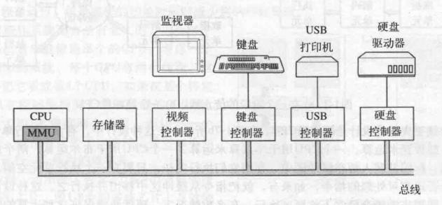
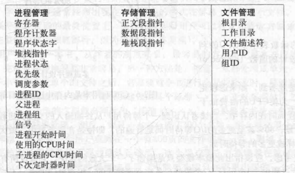
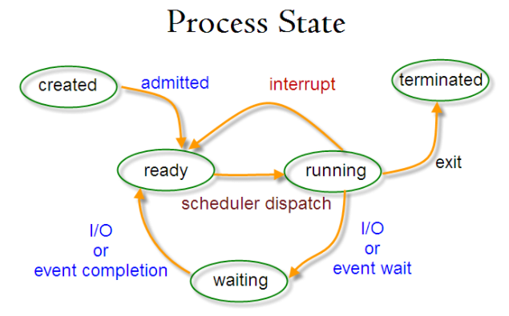

参考：拓跋阿秀、帅地玩编程、小贺、星空之座 八股文  CSNote 《现代操作系统第四版》（陈向群译）

推荐视频教程 [爆肝上传！清华大佬终于把困扰我大学四年的【计算机操作系统】讲的如此通俗易懂_哔哩哔哩_bilibili](https://www.bilibili.com/video/BV1wq4y1M7qf?spm_id_from=333.337.search-card.all.click)

有时间建议一定花一两天阅读一遍 现代操作系统，比只看面经管用很多。

## 操作系统知识点

### 概述

操作系统的定义：资源管理观点和扩展的机器观点。在资源管理的观点中，操作系统的任务是有效管理系统的各个部分，在扩展的机器观点中，系统的任务是为用户提供比实际机器更加便于运用的抽象。包括进程，地址空间和文件等。

计算机硬件基础：一个简单个人计算机部件可以抽象为如下结构：

**CPU** 

每个CPU都有对应的专门**指令集**，因此x86处理器不能够处理ARM程序。由于直接访问内存得到指或者数据的时间比执行指令的时间还要长，因此CPU内部存在各种寄存器，比如程序计数器PC或者**堆栈指针寄存器**（用于保存相关输入参数 局部变量等）以及**程序状态字寄存器（PSW)**,控制各种CPU优先级，用户态/内核态切换 以及状态控制位。因此发生IO中断时候，操作系统应该将所有现场保留，处理中断程序，然后恢复寄存器恢复堆栈恢复执行之前的指令。为了改善性能，设计师设计了**流水线机制**，但是同样会增加操作系统设计的复杂度。现在更先进的做法是**超标量CPU**,即有多个CPU分别用于不同的运算，同时有多个不同的执行单元，执行单元在执行完当前指令之后之间向缓冲区读取待执行指令执行，现代分布式计算往往也存在这种**缓冲申请设计**。

**用户态和内核态** PSW中存在一个控制位，当在内核态时候CPU可以执行**指令集中的任意一条指令**，并且使用硬件的每种功能，在台式机和服务器上，操作系统运行在内核态，嵌入式操作系统则部分在内核态部分在用户态，因此有内核编程这一说，参考学过的嵌入式中的kprintf。用户程序运行在用户态，仅能够执行指令集的一部分和硬件功能的一部分，有关的内存指令和IO读取是禁止的，因此可以推测出编程实现硬件操作：即用户系统调用（陷入内核）需要完成用户态到内核态的转换。

**存储器**

从快到慢：寄存器 高速缓存（L1 L2）主存 磁盘

最常用的高速缓存（硬件控制）放在CPU内部，比如某个程序需要读一个字时候，高速缓存硬件会检测需要的行是否在缓存中。如果是，则高速缓存命中，否则去主存中找，再其次去磁盘找。都是一个道理，即缓存机制用来提高执行效率，从而不用浪费时间在寻找内存位置上面。

现代CPU通常含有两级缓存，**L1缓存**用来将已经解码的指令调入CPU的执行引擎，L2缓存用来放置最近使用过的内存字，两个缓存的区别在于L2相比于L1缓存（不存在时延）存在一到两个时钟周期。

现代的内存条比如 DDR5 使用的是DDR SDRAM**同步动态随机存储器**，同步对象是系统时钟频率。

注意：**ROM 和 RAM都是主存 也就是内存 只不过具有不同的性质**

而常说的外盘实际指的是硬盘（磁盘）、 EEPROM、固态硬盘（闪存）等。

**I/O设备**

实现输入输出的方式一般有三种：

一是忙等待，跳转直到IO设备空闲并且执行完IO处理再返回

二是中断， 根据设备状态判断是否执行中断，也存在中断优先级等

三是特殊的直接存储访问DMA，即将设备看做文件流处理，控制内存和某些控制器之间的位流,完成后再中断。

**总线**

PCIE总线采取串行总线方式 CPU通过DDR总线和内存对话，通过PCIE总线和图形设备对话，通过DMI总线和平台控制集成中心对话，然后可以通过各种PCIE插槽、SATA插槽、USB插槽连接外设。

**操作系统四个特征**：并发（进程与线程）、共享（文件系统）、虚拟（内存管理）、异步（输入/出输出、系统调用）

**微内核概念 与之对应存在 单体系统、层次系统**

在分层方式（即分层设计操作系统，存在用户程序、输入输出、进程通信、存储管理等层次）中，需要界定内核-用户的边界，微内核的设计思想是为了实现高可靠性，将操作系统划分成各种小的模块，其中一个微内核执行在内核态，其余的作为普通用户进程。尽管这不安全，但是能够防止因为一点小错误造成整个系统死机，即现代设计中常见的容灾思想。例如再生服务器，当一个服务器出现错误时候立刻取代它，从而让系统具有自我修复能力。

### 进程与线程

**进程线程管程概念区别**

|          | 进程                                                         | 线程                                               | 管程                                                         |
| :------- | :----------------------------------------------------------- | :------------------------------------------------- | :----------------------------------------------------------- |
| 定义     | 资源分配和拥有的基本单位                                     | 程序执行的基本单位                                 | 用户态的轻量级线程，线程内部调度的基本单位                   |
| 切换情况 | 进程CPU环境(栈、寄存器、页表和文件句柄等)的保存以及新调度的进程CPU环境的设置 | 保存和设置程序计数器、少量寄存器和栈的内容         | 先将寄存器上下文和栈保存，等切换回来的时候再进行恢复         |
| 切换者   | 操作系统                                                     | 操作系统                                           | 用户                                                         |
| 切换过程 | 用户态->内核态->用户态                                       | 用户态->内核态->用户态                             | 用户态(没有陷入内核)                                         |
| 调用栈   | 内核栈                                                       | 内核栈                                             | 用户栈                                                       |
| 拥有资源 | CPU资源、内存资源、文件资源和句柄等                          | 程序计数器、寄存器、栈和状态字                     | 拥有自己的寄存器上下文和栈                                   |
| 并发性   | 不同进程之间切换实现并发，各自占有CPU实现并行                | 一个进程内部的多个线程并发执行                     | 同一时间只能执行一个协程，而其他协程处于休眠状态，适合对任务进行分时处理 |
| 系统开销 | 切换虚拟地址空间，切换内核栈和硬件上下文，CPU高速缓存失效、页表切换，开销很大 | 切换时只需保存和设置少量寄存器内容，因此开销很小   | 直接操作栈则基本没有内核切换的开销，可以不加锁的访问全局变量，所以上下文的切换非常快 |
| 通信方面 | 进程间通信需要借助操作系统                                   | 线程间可以直接读写进程数据段(如全局变量)来进行通信 | 共享内存、消息队列                                           |

**进程控制块PCB** 

进程控制块用于描述进程的状态和基本信息，进程的创建和和销毁都实际上改变这个控制块（表）的内容，其结构大致为：

**进程状态切换**

当然还有挂起状态，写过多线程会比较清楚。

**进程调度**

进程调度的算法同样适用与线程调度，调度的目的是为了实现在特定情况下的负载均衡。在操作系统中，CPU属于稀缺资源，因此需要设计调度算法提高CPU的利用率。

三种典型的进程调度环境

批处理环境：不会有用户在终端发出短请求 不需要有抢断行为

**先来先服务**

**最短作业优先**

**最短剩余时间优先**

交互式环境：为了避免占用和无限循环

**时间片轮转**

**优先级队列**

**多级反馈队列**

**公平分享调度**

实时环境 

软实时和硬实时系统，如果可以进行调度的实时要求可以进行上述调度算法选择

**进程同步**

临界区 信号量 互斥量  条件变量 管程 

**进程通信方式和优缺点 需要通过操作系统**

1 无名管道 linux管道命令符？

- 相当于内核空间的一个特殊文件，无名管道的无名就是指这个虚幻的“文件”，没有名字
- 可以通过pipe函数来创建
- pipe函数会在进程内核空间申请一块内存（比如一个内存页，一般是 4KB），然后把这块内存当成一个先进先出（FIFO）的循环队列来存取数据，这一切都由操作系统帮助我们实现了
- 无名管道只能进行半双工通信
- 如果想要实现全双工，可以再多开一个无名管道
- 本质上时内核缓冲区，当缓冲区满了或者空了，会控制相应的读写进程进入等待队列，等缓冲区满足条件后再唤醒对应的进程

- 由于无名管道没有名字，只是内核空间的一块内存，因此只适用于父子进程间的通信
  - 父进程通过pipe创建管道，获得读写文件描述符后，通过fork函数创建子进程
  - 此时子进程拥有同样的文件描述符
  - 由于无名管道半双工的特点，父子进程只能一个保留写一个保留读

2 有名管道

- 有名管道使用一个实实在在的FIFO类型的文件，意味着即时没有亲缘关系的进程也可以相互通信了，只要不同的进程打开相同的FIFO文件即可
- 通过命令 mkfifo 创建FIFO类型文件
- FIFO文件特点：
  - 文件属性前面标注的文件类型是 p，代表管道
  - 文件大小是 0
  - fifo 文件需要有读写两端，否则在打开 fifo 文件时会阻塞
  - 也会半双工

3 共享内存

- 过程
  - 根据已知的key使用shmget函数获取或者创建内核对象，并且返回内核对象的id号
    - key一般是事先约定好的
  - 根据id号获取内存地址
  - 向内存读写数据

- 使得多个进程可以直接读写同一个内核中的内存空间
- 由于多个进程共享一段内存，因此需要依靠某种同步机制(如信号量)达到进程间的同步和互斥

- 速度相对来说是比较快的
- 因为两个进程的虚拟地址空间直接映射到同一个物理内存中
- 不用每次将数据从内核拷贝到用户空间再拷贝回去
- 基本上共享内存中的数据直到通信完成才会写回去文件中
- 因此一个共享内存只有两次复制，一次从文件到内存，一次从内存到文件
- 比较典型的linux内核支持方式就是mmap调用

4 内核对象

- 内核对象是位于内核空间的一个结构体
- 对于共享内存、消息队列和信号量，在内核空间中均有对应的结构体来描述
- 每个内核对象都有自己的id号，供用户空间使用

- 获取方法：
  - shmget：共享内存
  - msgget：消息队列
  - semget：信号量

5 消息队列

- 消息队列本质上是位于内核空间的链表，链表的每个节点都是一条消息。每一条消息都有自己的消息类型，消息类型用整数来表示，而且必须大于 0.
- 不同类型的消息被挂载到对应类型的链表上
- 消息类型为0的链表记录了所有消息加入队列的顺序

- 消息数据格式：
  - 需要保证首4字节是一个整数，代表消息类型，大于0
  - 消息正文可以依照需求设计

- 好处
  - 克服了消息传递信息小，管道只能承载无格式字节流以及缓冲区大小受限的不足
  - 它独立于发送和接收进程存在，避免有名管道的同步和阻塞问题

- 核心函数：
  - msgsnd
  - msgrcv
  - msgget

信号量

- 信号量是一个计数器，一般用于进程同步以及多进程对共享资源的访问
- 等待(P(sv))就是将其值减一或者挂起进程，发送(V(sv))就是将其值加一或者将进程恢复运行

7 信号 例如 kill命令

- 信号产生条件
  - 按键
  - 硬件异常
  - 进程调用kill函数将信号发送给另外一个进程
- 信号传递的消息较少，一般用于通知进程某个事件的发生
  - 通过注册信号处理函数来对接收到的信号进行处理

- **kill -pid** 
  - 标准的kill命令通常都能达到目的。终止有问题的进程，并把进程的资源释放给系统。然而，如果进程启动了子进程，只杀死父进程，子进程仍在运行，因此仍消耗资源。为了防止这些所谓的“僵尸进程”，应确保在杀死父进程之前，先杀死其所有的子进程。
  - ps -ef | grep httpd   找到要杀死的父进程和子进程
- **kill -l PID** 
  - -l选项告诉kill命令用好像启动进程的用户已注销的方式结束进程。当使用该选项时，kill命令也试图杀死所留下的子进程。但这个命令也不是总能成功--或许仍然需要先手工杀死子进程，然后再杀死父进程
- **kill -TERM PPID** 
  - 给父进程发送一个TERM信号，试图杀死它和它的子进程。 
- **kill -HUP PID** 
  - 该命令让Linux和缓的执行进程关闭，然后立即重启。在配置应用程序的时候，这个命令很方便，在对配置文件修改后需要重启进程时就可以执行此命令。
- 绝杀 **kill -9 PID** 
  - kill -s SIGKILL 
  - 这个强大和危险的命令迫使进程在运行时突然终止，进程在结束后不能自我清理。危害是导致系统资源无法正常释放，一般不推荐使用，除非其他办法都无效。

8 套接字 sockets

- 用于更为一般的进程间通信
- 可以用于不同机器间的进程通信

**不同通信方式的优缺点？**

- 管道：速度慢，容量有限；
- Socket：任何进程间都能通讯，但速度慢；
- 消息队列：容量受到系统限制，且要注意第一次读的时候，要考虑上一次没有读完数据的问题；
- 信号量：不能传递复杂消息，只能用来同步；
- 共享内存区：能够很容易控制容量，速度快，但要保持同步，比如一个进程在写的时候，另一个进程要注意读写的问题，相当于线程中的线程安全，当然，共享内存区同样可以用作线程间通讯，不过没这个必要，线程间本来就已经共享了同一进程内的一块内存。

### 内存管理

虚拟内存机制（虚拟机制）

#### 死锁

死锁的必要条件：互斥 占有和等待 不可抢占 环路等待

死锁的处理方法：

鸵鸟策略 

死锁检测和死锁恢复：破坏互斥条件 破坏占有和等待条件 破坏不可抢占条件 破坏环路等待

死锁避免：安全状态 银行家算法

#### 内存管理

虚拟内存 

分页系统地址映射

页面置换算法：最佳 最近最久未使用  最近未使用 先进先出 第二次机会 clock时钟算法

分段技术 分页和分段的比较

#### 磁盘管理

磁盘调度算法：先来先服务 最短寻道时间 电梯算法

## 面经以及回答：

拓跋阿秀面经问题：

1、进程、线程和协程(管程) 的区别

定义 切换情况 切换者切换过程 调用栈 拥有资源 并发性 系统开销 通信方面

2、一个进程可以创建多少个线程

3、外中断和异常的区别

4、 原子操作

5、进程调度算法

6、linux下进程通信 

7、linux下同步机制

8、系统中存在块表之后，地址的转换过程变成什么样了？

9、动态分区分配算法有哪几种？详细说说？

首次适应算法 最佳适应算法 最坏适应算法 临近时应算法

10 虚拟技术 （时分复用和空分复用技术）

13 进程状态以及切换（七种和五种）

14 程序从开始到运行结束的完整过程？

预编译 编译 汇编 链接(动态 静态)

15、通过例子讲解逻辑地址转换为物理地址的基本过程。

16、进程同步的四种方法？

17、操作系统在对内存进行管理的时候需要做些什么？

18、进程通信方法？线程通信方式？

19、虚拟内存的目的是什么？

20、什么是内存、作用？

24、介绍一下几种典型的锁？

读写锁、互斥量、条件变量、自旋锁？

25、怎么回收线程？有几种方法？

26、内存的覆盖是什么？有什么特点？(页面交换)

27、内存交换技术和使用时间？

28、如何让进程后台运行？（

比较常见的是

① nobup 命令 +&

② ctrl+z 直接挂起进程

③ 将命令+&放在（）里面

④使用screen命令

29、什么是块表？有什么用？

30、守护进程、僵尸进程、孤儿进程、

31、如何避免僵尸进程？

32、子进程 父进程 作业和会话？

33、进程终止的几种方式？ 五种

34、中断和异常的区别？

中断：硬件 异常：cpu

35、一般情况下linux和windows平台下栈空间的大小？

36、程序从堆中动态分配内存时候，虚拟内存上怎么操作的？

37、抖动是什么?

38、内存交换中，被换出的进程保存在哪里?

39、内存置换算法？

40、为什么分段式存储管理系统有外部碎片而无内部碎片？

41、如何消除碎片文件？

「herongwei」面试题目总结 与上面相同的不记录：

42、递归锁？

43、函数调用和系统调用？

44、常⻅的IO模型，五种？异步IO应⽤场景？有什么缺点？

45、IO复用的原理？零拷贝？(网络编程)

操作系统的面经到此结束，具体进程线程代码在unix 网络编程中学